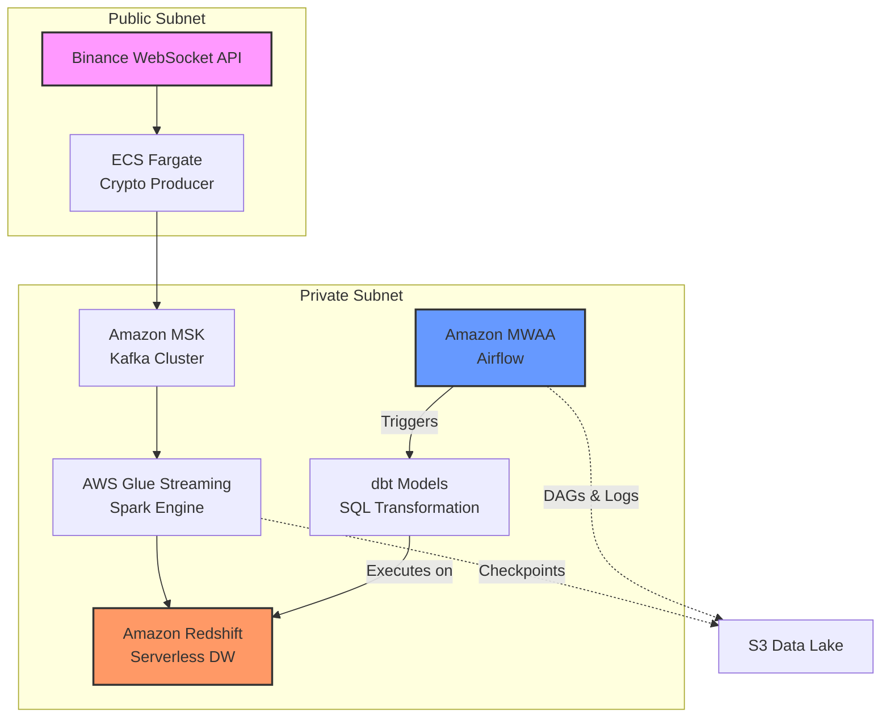

## 🚀 Real-Time Crypto Data Pipeline on AWS
### 📌 Overview

This project implements a **production-grade real-time data pipeline** on AWS, processing streaming cryptocurrency data from ingestion to analytics.

It demonstrates how to combine:

* **Containerized streaming ingestion (ECS Fargate)**
* **Managed Kafka (MSK)**
* **Serverless Spark streaming (AWS Glue)**
* **Data warehouse (Redshift Serverless)**
* **Transformation (dbt)**
* **Orchestration (Airflow / MWAA)**
---
### 🖼️ Architecture Diagram

---
### ⚙️ Tech Stack
| Layer | Technology | Role |
|-------|------------|------|
| Compute (Ingest) | ECS Fargate | **Serverless Ingestion:** <br>Runs the Python producer as a containerized service to fetch real-time data. |
| Streaming | Amazon MSK | **Message Broker:** <br>Decouples data ingestion from downstream processing with a high-throughput Kafka cluster. |
| Processing | AWS Glue Streaming | **Real-time ETL:** <br>Executes Spark Streaming jobs for window aggregation and data cleaning within a private VPC. |
| Storage | Amazon S3 | **Metadata & Checkpoints:** <br>Stores Spark structured streaming checkpoints for fault tolerance and hosts application scripts/Airflow assets. |
| Warehouse | Redshift Serverless | **OLAP Engine:** <br>Provides high-performance analytics without managing physical clusters; stores the Gold layer. |
| Transformation | dbt (Data Build Tool) | **Data Modeling:** <br>Implements Medallion architecture (Staging/Fact) using SQL and ensures data quality with tests. |
| Orchestration | Airflow (MWAA) | **Workflow Orchestrator:** <br>Manages end-to-end task dependencies, scheduling dbt runs and monitoring pipeline health. |
| Language | Python / SQL | **Core Logic:** <br>Python for stream processing and SDKs; SQL for transformation and analytical queries. |
---
### 🔄 Detailed Data Flow
### 1️⃣ Data Ingestion — Binance Producer (ECS Fargate)
* Python script subscribes to **Binance WebSocket API**
* Runs inside a Docker container
* Deployed via **ECS Service on Fargate**

**How it works:**
* Docker image pushed to **Amazon ECR**
* ECS service launches container automatically
* No server management (serverless container)

**Networking:**
* Runs in **Public Subnet**
* Assigned **public IP**
* Can access external Binance API

**Output:**
* Sends streaming JSON data to **MSK (Kafka)**
---
### 2️⃣ Data Buffer — Amazon MSK (Kafka)
* Acts as a **durable streaming buffer**
* Decouples ingestion and processing

**Why important:**

* Prevents data loss
* Handles backpressure
* Enables scalable consumers
---
### 3️⃣ Real-Time Processing — AWS Glue Streaming (Spark)
Runs as a **serverless Spark streaming job**
Reads data from Kafka (MSK)

**Core Logic:**

* Micro-batch processing
* Window aggregations:
* `max_trade`
* `total_value`

**Key Design (VERY IMPORTANT ⭐):**

* Runs in **Private Subnet**
* Uses **Glue VPC Connection**

👉 This enables:

* Access to MSK (private network)
* Direct connection to Redshift Serverless
* No exposure to public internet

**Output:**

* Writes processed data directly into **Redshift tables**
* Target Schemas are pre-initialized via Terraform/DDL to ensure strict security governance, while Spark handles high-throughput data sinking.
---
### 4️⃣ Data Warehouse — Redshift Serverless
* Stores structured, analytics-ready data
* Receives data directly from Glue

**Key Feature:**

* No cluster management
* Scales automatically
---
### 5️⃣ Transformation — dbt
* Builds analytics layer on top of raw tables

Includes:

* staging models
* fact tables
* data quality tests
---
### 6️⃣ Orchestration — Airflow (MWAA)
* Schedules and manages workflows:
    - dbt runs
    - dependency management
---
### 🌐 Network Architecture (Interview Highlight ⭐)
| Component | Subnet | Reason |
|-----------|--------|--------|
| ECS Producer | Public Subnet | Needs internet access (Binance API) |
| MSK Kafka | Private Subnet | Secure internal communication |
| Glue Streaming | Private Subnet | Access MSK + Redshift securely |
| Redshift Serverless | Private | Data warehouse security |

* Utilized S3 VPC Gateway Endpoints to allow private Glue/MWAA instances to communicate with S3 without traversing the public internet, reducing NAT costs and latency.

👉 This design ensures:

* Secure internal data flow
* No unnecessary public exposure
* Proper separation of concerns
---
### 🚀 Technical Challenges
**🛠️ Key Technical Challenges & Solutions**
| Challenge | Action & Key Solution |
|-----------|----------------------|
| **1. VPC Connectivity & Private Access** | **Issue:** AWS Quicksight (Managed Service) couldn't access Redshift Serverless in a private subnet.<br>**Solution:** Configured Security Group Self-Referencing rules and established a QuickSight VPC Connection (ENI) to bridge the network gap without public exposure. |
| **2. Financial-Grade Data Precision** | **Issue:** Micro-transaction values (e.g., 0.0081 BTC) were truncated to zero during Spark-to-Redshift ingestion.<br>**Solution:** Enforced DECIMAL(18,8) across the entire schema and tuned Spark JDBC precision settings to ensure zero data loss for whale alerts. |
| **3. MWAA Dependency Management** | **Issue:** Installing dbt-redshift directly via MWAA's requirements.txt caused environment instability and core library version conflicts (e.g., botocore mismatch).<br>**Solution:** Implemented PythonVirtualenvOperator to isolate the dbt execution environment. Developed a wrapper function to dynamically invoke dbt via Subprocess within a dedicated virtual environment, ensuring the host Airflow environment remains clean and stable. |
| **4. Spark JDBC DDL Limitations** | **Issue:** Glue Streaming jobs failed to dynamically create Redshift schemas due to JDBC driver and IAM permission constraints.<br>**Solution:** Shifted to a Pre-initialization Strategy, creating schemas via SQL before job execution to ensure infrastructure stability and governance. |
| **5. Stream Processing Idempotency** | **Issue:** Kafka message re-processing or Spark retries could lead to duplicate trade records in the warehouse.<br>**Solution:** Implemented MD5-hashed unique_keys (ticker + timestamp) combined with dbt's delete+insert incremental strategy to ensure exactly-once semantics. |
---
### 📁 Project Structure
```
.
├── producer/          # Binance WebSocket producer
├── streaming/         # Glue Spark job
├── dbt/               # dbt models
├── airflow/           # DAGs
├── terraform/         # AWS infrastructure
├── docs/              # diagrams/screenshots
└── README.md
```
---
### 🚀 Getting Started
**1. Deploy Infrastructure**
Initialize and deploy the full AWS stack (VPC, MSK, Redshift, MWAA, etc.) using Terraform.
```bash
cd terraform
terraform init
terraform apply
```
**2. Synchronize Assets to S3**
Upload your dbt project and Spark streaming scripts to the S3 bucket (which MWAA and Glue use as a source).
* dbt project: Upload to s3://<your-bucket>/airflow-assets/dags/crypto_dbt/
* Spark script: Upload to s3://<your-bucket>/scripts/spark_stream_processor.py

**3. Start the Pipeline**
* Ingestion: The ECS Fargate producer starts automatically upon deployment and begins pushing data to MSK.

* Processing: Navigate to AWS Glue Console and start the crypto-streaming-processor job.

* Transformation & Analysis:

* Open the MWAA (Airflow) UI.

* Find the crypto_whale_analytics_dag.

* Trigger the DAG: This will internally create a Python Virtualenv, install dependencies, and execute dbt run/test within the isolated environment.
---
### 📊 Actionable Insights from Dashboard
This project transforms raw WebSocket streams into high-level market intelligence. Below are the key analytical conclusions derived from the QuickSight dashboard:

**1. Real-Time Surveillance — Alert Details (Table 📋)**
* High-Intensity Hotspots: Multiple HIGH ACTIVITY signals (>100 trades/min) for a specific ticker.

    - Insight: The asset has become a market focal point, likely due to breaking news or a liquidations cascade.

* Critical Threat Detection: Rows where trader_category is MEGA WHALE and market_signal is VOLATILE WHALE MOVE.

    - Insight: This is the Primary Watchlist. It identifies the exact moment and asset where a single large player is causing significant price displacement (>2% movement).

**2. Market Composition — Whale Activity (Donut Chart 🍩)**
* Retail-Dominant Phase: If RETAIL accounts for >90% of transactions.

    - Insight: The market is in a consolidation or "sideways" phase. Price movements are likely driven by random noise rather than institutional intent.

* Whale Entry Phase: If MEGA WHALE (trades > 1.0 BTC/unit) or WHALE proportions spike suddenly.

    - Insight: High-net-worth players are active. Regardless of direction, a surge in whale activity is a leading indicator of an imminent volatility breakout.

**3. Volume-Price Correlation — Anomaly Detection (Combo Chart 📊)**
* Absorption / Distribution: High total_value spikes accompanied by a flat price line.

    - Insight: This indicates a "hidden battle" where large orders are being absorbed by the opposing side. It often precedes a major trend reversal.

* Volatility Confirmation: total_value surges synchronized with the VOLATILE WHALE MOVE signal.

    - Insight: This confirms a Whale Shakeout. By observing the slope of the price line, users can determine if the smart money is aggressively pushing the market up or dumping assets.


---
### 🧠 Key Engineering Decisions (Architecture Rationale)
**Why ECS Fargate? (Ingestion Layer)**

* Decision: Decoupled the Python producer from the main ETL engine.

* Rationale: Used Fargate for Serverless container execution, eliminating EC2 maintenance while providing an isolated environment to maintain a persistent WebSocket connection with Binance.

**Why Amazon MSK? (Messaging Layer)**

* Decision: Introduced a managed Kafka cluster as a distributed message buffer.

* Rationale: Ensures system resilience and high-throughput buffering. It decouples the spikey nature of crypto market data from the downstream Spark processing, preventing data loss during peak volatility.

**Why AWS Glue Streaming? (Processing Layer)**

* Decision: Leveraged Spark Structured Streaming via AWS Glue.

* Rationale: Provided a Serverless Spark environment that scales workers automatically. It natively supports Watermarking and Windowing, which are critical for calculating real-time "Whale" metrics without managing an EMR cluster.

**Why Redshift Serverless? (Warehouse Layer)**

* Decision: Selected a Serverless OLAP sink.

* Rationale: Optimized for Cost-Efficiency and Instant Scaling. It allows the pipeline to handle massive analytical queries from dbt/QuickSight without the overhead of manual cluster resizing.
---
### 💡 Core Competencies Demonstrated
* End-to-End Streaming Design: Bridging the gap between raw WebSockets and a structured Data Warehouse.

* Production-Grade Networking: Implementing a Zero-Trust VPC architecture (Private Subnets, NAT Gateways, and Security Group Self-referencing).

* Modern DevOps / IaC: 100% infrastructure reproducibility via Terraform.

* Environment Isolation: Advanced Airflow orchestration using PythonVirtualenvOperator to bypass dependency hell.

* Data Integrity & Governance: Handling high-precision financial decimals and ensuring Exactly-Once semantics via dbt incremental strategies.
---
### 👤 Author

Beiqi Su
